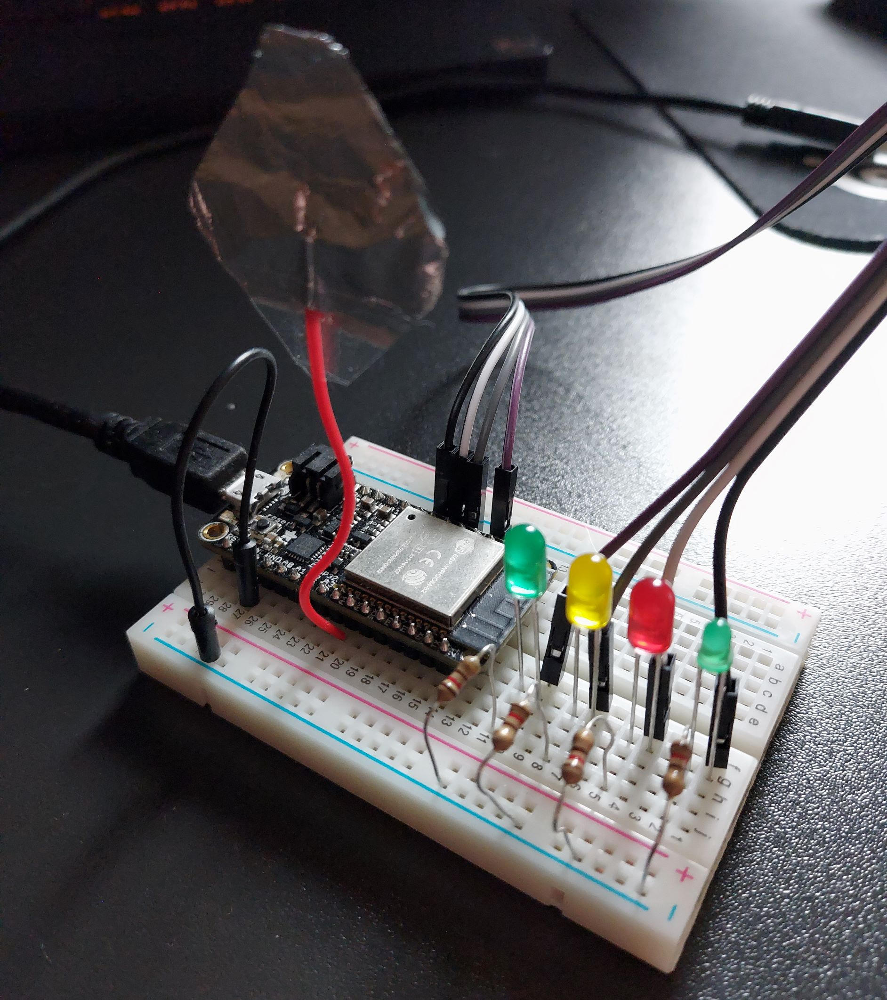
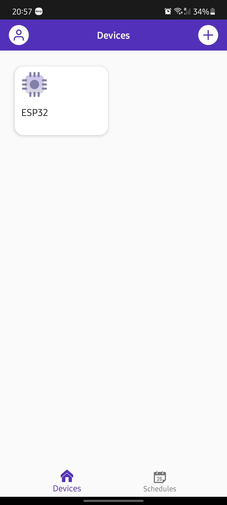
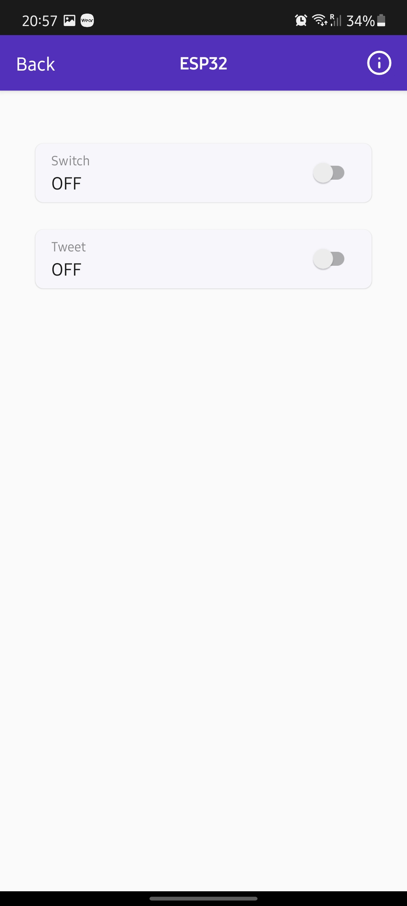
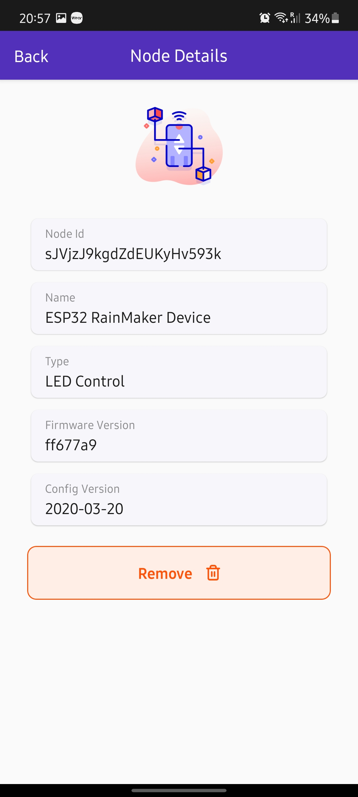
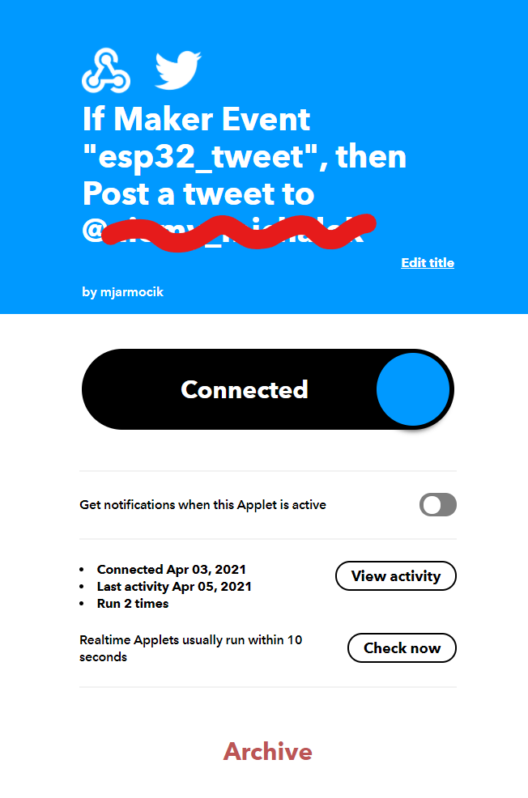

# Touchy thing (Assignment 1)

## Device :computer:

### Input
The device uses a touch sensor - a cable with a tin foil is attached to the microcontroller's GPIO4.

It also listens to commands from the cloud via Rainmaker software.

### Output
4 LEDs are connected to the device.
1. Green LED  (big one) lights up whenever the device detects touch input.
2. Yellow LED blinks three times when user touches the tin foil three consecutive times (with < 1s delays between touches) - to indicate that the device will attempt to send a Tweet.
3. Red LED blinks if the device fails to send a HTTP request (to send a tweet)
4. Green LED (small one) blinks when the HTTP request was sent successfuly.

Additionaly, the device is connected to WiFI and is able to communicate via HTTP.

## Software :game_die:
The software was developed using PlatformIO, ESP Rainmaker and IFTTT.

Application entry point is located in src/app_main.c file. 
The main file sets-up the Rainmaker. There are also two other modules (also in src folder): touch.c is responsible for monitoring touch and ifttt.c handles communication with IFTTT apple for sending a Tweet.

### Rainmaker
Rainmaker handles provisioning and allows for sending information to the device from the cloud via smartphone.

Once the device is connected to WiFi, user can turn the built-in LED on and off or send a Tweet.
(Twitter command uses a toggle. It's because Rainmaker app doesn't support button as an UI element.)

The built-in LED toggle was implemented to quickly test if the device is properly connected to WiFi and the cloud.

Addionally, in order to use Rainmaker, partition tables were changed. The configuration of the tables is in the default.csv file.

### Touch
touch_pad ESP-IDF library is used to handle the touch. 

The module starts a separate task which continuously measures the touch sensor value and, when triple touch detected, sends a Tweet using ifttt module.

### IFTTT
The ifttt.c module provides a function which sends a HTTP get request to a IFTTT applet which then posts a Tweet on my personal Twitter account.  

# Video Demo :movie_camera:
Simple demo: Three touches to send a Tweet, switching built-in LED on and off, then sending a Tweet again, this time via Rainmaker.

  
(Click to go to Youtube)

# Disclaimer :warning:
The project contains files developed by espressif.
The components folder contains files from https://github.com/espressif/esp-rainmaker which are used to setup the Rainmaker.

The app_main.c sets up the Rainmaker by following the steps from https://rainmaker.espressif.com/ , and so, that part of the code is very similar to what is shown in the tutorial.

